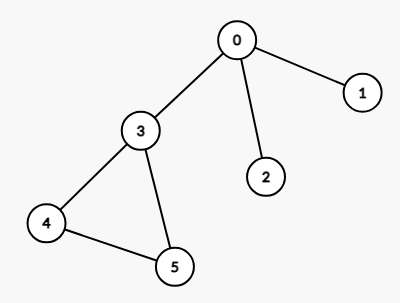
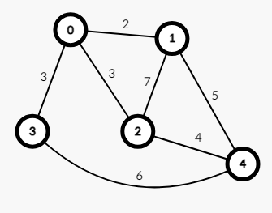

# Disjoint Set Union (DSU) and Kruskal's Algorithm

## Why We Use DSU?

### Cycle Detection in Unweighted Graphs
DSU is used to detect cycles in undirected, unweighted graphs. It doesn't work directly with weighted graphs because it doesn't account for edge weights or directions; its focus is on node connectivity.

### Minimum Spanning Tree (MST)
DSU is used in Kruskal's Algorithm to help find the MST by efficiently managing the merging of sets when adding edges.

---

## Kruskal's Algorithm

### How It Works
Kruskal's algorithm sorts its edges based on their weight and uses DSU to efficiently build the Minimum Spanning Tree.

### Why Minimum Spanning Tree (MST)?
The Minimum Spanning Tree **connects all nodes of a graph with the lowest total edge weight**. This is different from finding the shortest path, as MST focuses on connecting all nodes with minimal cost rather than finding the shortest route between two specific nodes.

---

## Test Cases

### Test Case 1

### Test Case 2

*Note: If you consider these two graphs are the same, you are right.*

---

## Resources
- [Kruskal's Algorithm Explained](https://www.programiz.com/dsa/kruskal-algorithm)