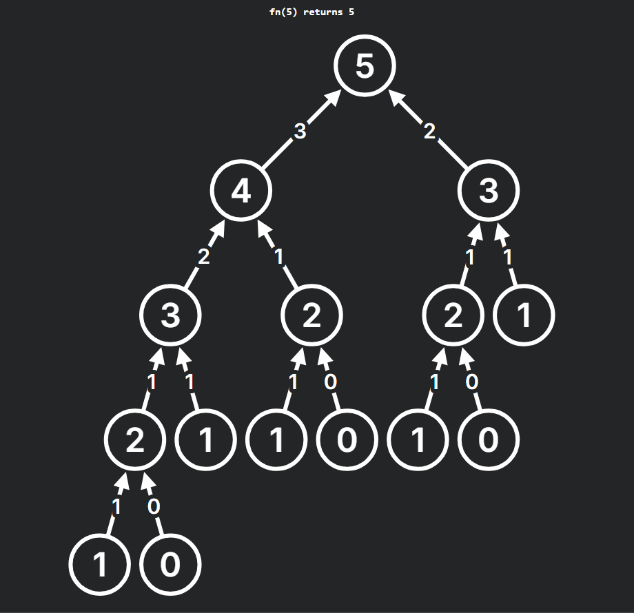
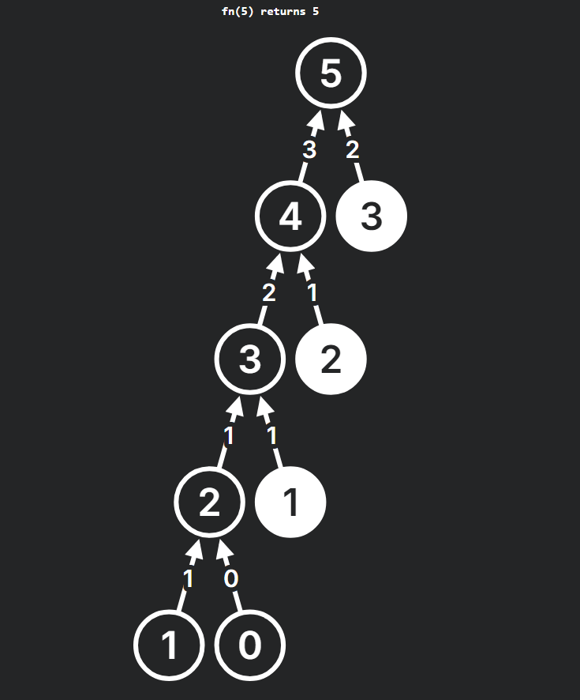

### Recursion Tree Visualizer ⭐⭐⭐

- [https://recursion.vercel.app/](https://recursion.vercel.app/)

### What is DP (Dynamic Programming)?

DP is a combination of a recursive solution/approach and optimization.

**Optimization:** Removing **duplicate calls** and reducing time complexity through memoization.

There are two types of DP:
1. Top-down (recursion with memoization)
2. Bottom-up (iteration using loops)

Both approaches stem from the same concept. The core idea is the recursive process. In many algorithms, we choose the DP approach for efficiency.

#### 🔁 Recursive Tree Without Memoization:

#### ✅ Recursive Tree With Memoization:

---

### Fibonacci Sequence

The Fibonacci sequence is:
0, 1, 1, 2, 3, 5, 8, 13, 21, …

- 0 + 1 = 1  
- 1 + 1 = 2  
- 1 + 2 = 3  
- 2 + 3 = 5  
- 3 + 5 = 8  
- 5 + 8 = 13  
- 8 + 13 = 21  